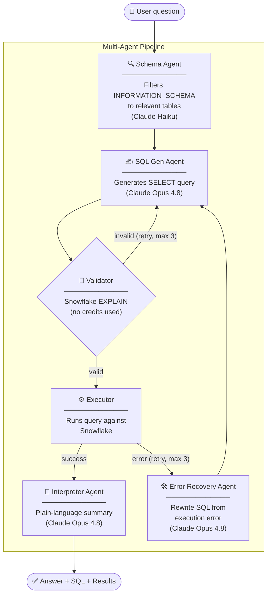

# Snowflake Query Assistant

Ask questions about your Snowflake data in plain English. A multi-agent pipeline powered by Claude translates your question into SQL, runs it, and returns a plain-language answer — with the raw results and generated SQL available in the UI.

## Architecture



Each stage is a plain function call — no framework, no message bus, no async.

| Agent | Model | Role |
|---|---|---|
| Schema | Haiku | Filters `INFORMATION_SCHEMA` to relevant tables |
| SQL Gen | Opus 4.8 | Writes a `SELECT` query |
| Validator | Snowflake EXPLAIN | Checks syntax/semantics without running the query |
| Error Recovery | Opus 4.8 | Rewrites SQL when execution fails |
| Interpreter | Opus 4.8 | Summarises results in plain language |

## Stack

- **Backend** — Python, FastAPI, `snowflake-connector-python`, Anthropic SDK
- **Frontend** — React, Vite

## Setup

```bash
pip install -r requirements.txt
cp .env.example .env   # fill in your credentials
```

`.env` variables:

```
ANTHROPIC_API_KEY=sk-ant-...
SNOWFLAKE_ACCOUNT=your-account.region
SNOWFLAKE_USER=your_username
SNOWFLAKE_PASSWORD=your_password
SNOWFLAKE_DATABASE=your_database
SNOWFLAKE_WAREHOUSE=your_warehouse
SNOWFLAKE_SCHEMA=PUBLIC          # optional, defaults to PUBLIC
```

```bash
cd frontend && npm install
```

## Running

**CLI**
```bash
python main.py                              # interactive chat loop
python main.py -q "Top 5 customers by revenue"   # single query
python main.py -q "..." --quiet             # suppress per-step logs
```

**Web app**
```bash
# terminal 1 — backend
uvicorn api.main:app --reload

# terminal 2 — frontend
cd frontend && npm run dev
```

Then open `http://localhost:5173`.

## Project structure

```
agents/
  schema.py          # table discovery
  sql_gen.py         # SQL generation
  validator.py       # EXPLAIN-based validation
  interpreter.py     # results summarisation
  error_recovery.py  # SQL correction on execution failure
  orchestrator.py    # pipeline coordinator
api/
  main.py            # FastAPI app
db/
  connection.py      # Snowflake connector
  schema_cache.py    # 5-minute TTL schema cache
frontend/
  src/App.jsx        # React chat UI
main.py              # CLI entrypoint
```
