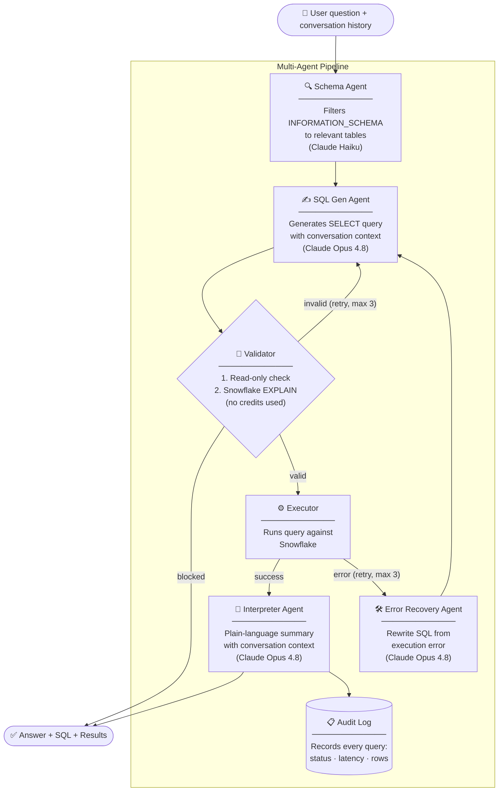

# Snowflake Query Assistant

Ask questions about your Snowflake data in plain English. A multi-agent pipeline powered by Claude translates your question into SQL, runs it against Snowflake, and returns a plain-language answer — with syntax-highlighted SQL, a scrollable results table, and CSV export.

**Live demo:** https://laudable-clarity-production.up.railway.app

---

## Features

| | |
|---|---|
| **Natural language queries** | Ask anything — no SQL knowledge required |
| **Conversation memory** | Follow-up questions resolve correctly ("filter that by region", "now just the top 3") |
| **Syntax-highlighted SQL** | Collapsible SQL block with highlight.js |
| **CSV export** | Download any result table in one click |
| **Query history** | Sidebar tracks every question in the session |
| **Audit log** | Every query logged with status, latency, and row count |
| **Read-only enforcement** | Only `SELECT`/`WITH` queries reach Snowflake — writes are blocked at the validator |
| **Password protection** | Shared password gate before the chat UI |
| **5 themes** | Dark, Midnight, Ocean, Sunset, Light — persisted to `localStorage` |
| **Mobile responsive** | Sidebar becomes a drawer on small screens |

---

## Architecture



Each stage is a plain function call — no framework, no message bus, no async.

| Agent | Model | Role |
|---|---|---|
| Schema | Haiku | Filters `INFORMATION_SCHEMA` to relevant tables |
| SQL Gen | Opus 4.8 | Writes a `SELECT` query, uses last 5 conversation turns as context |
| Validator | — | Enforces read-only; then runs Snowflake `EXPLAIN` |
| Error Recovery | Opus 4.8 | Rewrites SQL on execution failure |
| Interpreter | Opus 4.8 | Summarises results, uses last 3 conversation turns as context |

Retries up to `MAX_RETRIES = 3`. On validation failure the error is fed back to SQL Gen. On execution failure, Error Recovery rewrites the SQL first.

---

## Stack

- **Backend** — Python 3.11, FastAPI, `snowflake-connector-python`, Anthropic SDK
- **Frontend** — React 18, Vite, highlight.js
- **Deployment** — Railway (single service: Dockerfile builds frontend then serves it via FastAPI)

---

## Local setup

```bash
pip install -r requirements.txt
cp .env.example .env        # fill in credentials
cd frontend && npm install
```

**Environment variables** (`.env`):

```
ANTHROPIC_API_KEY=sk-ant-...
SNOWFLAKE_ACCOUNT=your-account.region
SNOWFLAKE_USER=your_username
SNOWFLAKE_PASSWORD=your_password
SNOWFLAKE_DATABASE=your_database
SNOWFLAKE_WAREHOUSE=your_warehouse
SNOWFLAKE_SCHEMA=PUBLIC          # optional, defaults to PUBLIC
APP_PASSWORD=your_app_password   # optional, gates the web UI
```

**Run locally:**

```bash
# terminal 1 — backend
uvicorn api.main:app --reload

# terminal 2 — frontend
cd frontend && npm run dev
```

Open `http://localhost:5174`. The frontend proxies `/query` and `/audit` to `localhost:8000`.

**CLI mode** (no frontend needed):

```bash
python main.py                                    # interactive chat loop
python main.py -q "Top 5 customers by revenue"   # single query, then exit
python main.py -q "..." --quiet                   # suppress per-step logs
```

---

## Deploying to Railway

1. Push to GitHub
2. Railway → New Project → Deploy from GitHub repo
3. Set environment variables in Railway dashboard (all `.env` vars above)
4. Railway auto-detects the `Dockerfile` and builds both frontend + backend
5. Generate a public domain under Settings → Networking

The `Dockerfile` uses a multi-stage build: Node builds the React frontend, then Python copies the `dist/` output and serves it via FastAPI's `StaticFiles`.

---

## Governance

| Control | Implementation |
|---|---|
| **Read-only enforcement** | `validator.py` rejects anything not starting with `SELECT`/`WITH`; blocks `INSERT`, `UPDATE`, `DELETE`, `DROP`, `CREATE`, `ALTER`, `TRUNCATE`, `MERGE` |
| **Audit logging** | Every query recorded in-memory (SQLite) and streamed as JSON to stdout; viewable at `GET /audit` or the sidebar Audit tab |
| **Password gate** | `APP_PASSWORD` env var; checked on every `/query` and `/audit` request via `X-App-Password` header |
| **Schema caching** | 5-minute TTL cache limits `INFORMATION_SCHEMA` calls |
| **Prompt caching** | SQL Gen system prompt carries `cache_control: ephemeral` to reuse the cached instruction across repeated calls |

---

## Project structure

```
agents/
  schema.py          # table discovery (Haiku)
  sql_gen.py         # SQL generation with conversation history (Opus 4.8)
  validator.py       # read-only enforcement + EXPLAIN validation
  interpreter.py     # results summarisation with conversation history (Opus 4.8)
  error_recovery.py  # SQL correction on execution failure (Opus 4.8)
  orchestrator.py    # pipeline coordinator, retry logic
api/
  main.py            # FastAPI app — /query, /audit, /verify, static SPA
db/
  connection.py      # Snowflake connector (DictCursor, uppercase column keys)
  schema_cache.py    # 5-minute TTL schema cache
  audit.py           # in-memory SQLite audit log
frontend/
  src/App.jsx        # React chat UI — themes, sidebar, history, audit tab
  src/App.css        # CSS custom properties, 5 theme definitions
Dockerfile           # multi-stage build for Railway
main.py              # CLI entrypoint
```
